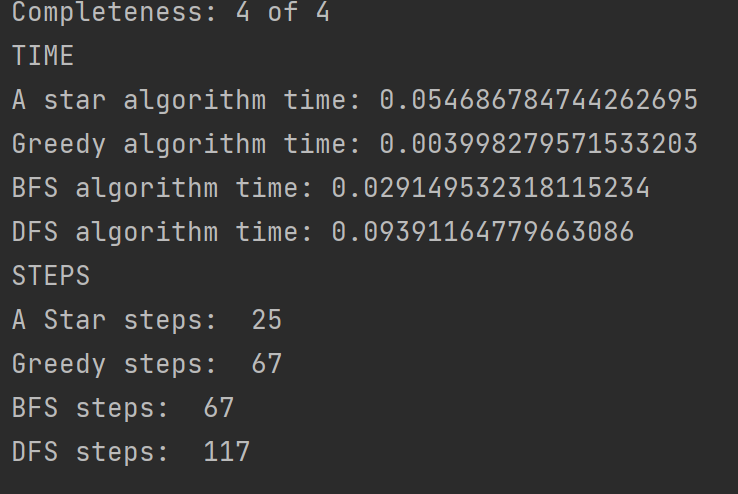

# Sokoban, Project 1

## How to Run

Right click on main.py and click run to begin program.  Place the input file in the
inputs folder.  Type the name of the file in the prompt on the console e.g. "test_file.txt".
Then, in the console type the number that corresponds to the program you are running e.g. if
running DFS algorithm, type "1" into the console.  Then when finished, the moves the AI made will appear
both in the console and saved in the outputs section under the same name as the input file name.

## DFS Results
DFS algorithm follows the newest value of the stack to return it, in the tests files I ran it in, it returned the most
steps of all the algorithms, however in terms of time, it took the quickest.

## BFS Results
BFS algorithm is similar to DFS, however it takes the oldest time on the stack instead of the newest,
in my test files, it should have returned the optimal value and taken the longest time, however it returned a good, 
better result than DFS, it did not return the most optimal value, or take the longest time
## Greedy Results
Greedy Algorithm uses the heuristic to determine which it should go for. It is in theory similar to DFS in terms of time
and memory requirements, while also returning with a better step than dfs, my results confirmed this, with a time faster 
than A star algorithm and BFS, but returning with a lower, if not optimal, amount of steps

## A Star Results
A star uses both the heuristic and a cost function, for the heuristic function, it finds the manhattan distance of the 
box's to the goal, the cost function is the robot location to the nearest box.  With these two, A Star consistently found
the most optimal solution and while it should have been faster than BFS, it still ended up being slower, which might have
been because of BFS containing less complex bit operation, or as BFS is not computing as it should.

## Pictures and Results
Test file 1: Easy

Results

Test file 2: Medium

Results

Test file 3: Hard

Results

